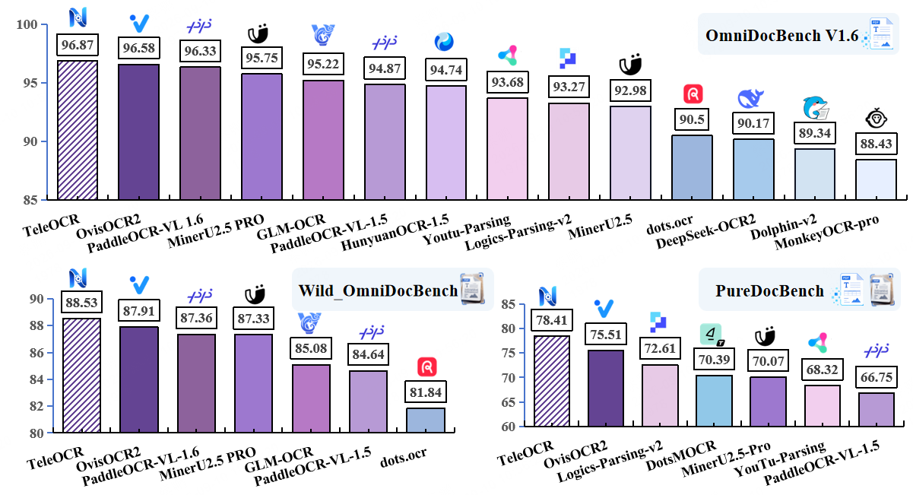
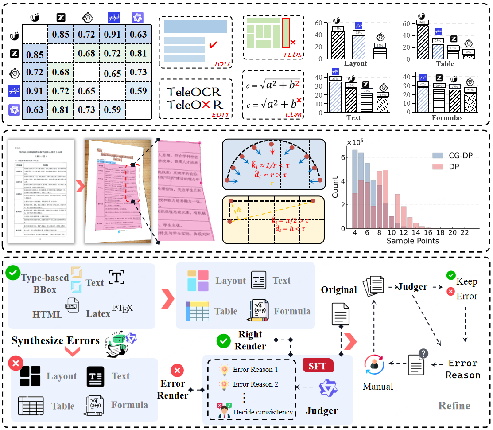
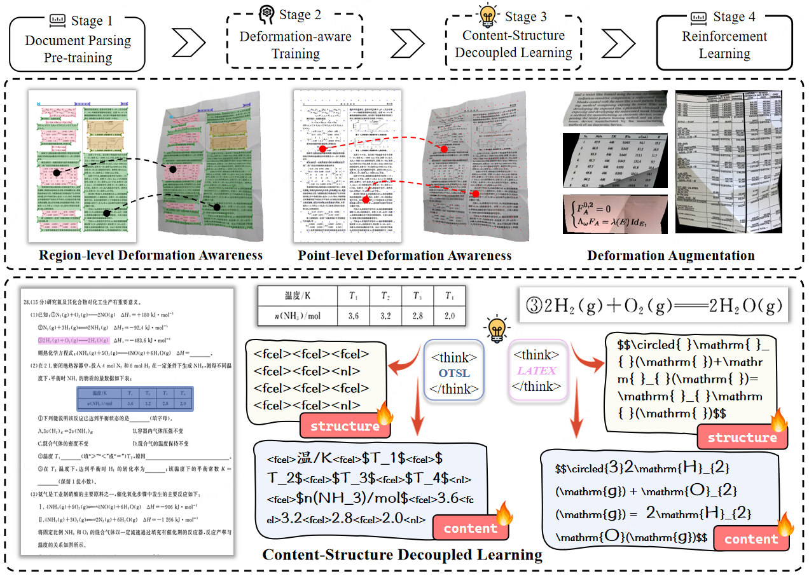

<div align="center">

#  TeleOCR

**TeleOCR: Navigating Document Parsing Across Digital and Camera-Captured Documents**

[](LICENSE)
[](https://huggingface.co/StarDoc-AI/TeleOCR)
[](https://paperswithcode.co/api/v1/papers/2608.12898/leaderboard-badge-link?eval=25856)
[](https://www.teleai.com.cn/docparse/DocumentParsing)
[](https://arxiv.org/abs/2608.12898)


**A lightweight Vision-Language Model for unified document parsing across digital and camera-captured documents.**

</div>

---

## 🔥 News

- **2026/09/10** - We have renamed NaviDC-OCR to TeleOCR, and all subsequent model iterations will be developed and released under the TeleOCR version.
- **2026/09/01** - We noticed that EMNLP 2026 is hosting the [Dr.DocBench Challenge](https://eval.ai/web/challenges/challenge-page/2717/overview), a document parsing competition. We evaluated NaviDC-OCR with its native weights, achieving better results than MinerU 2.5 Pro and PaddleOCR-VL 1.6. Detailed results are shown below **dr.docbench-challenge**. We welcome the use of NaviDC‑OCR for competitions. Going forward, we will continue to deliver competitive parsing models for the community.
- **2026/08/29** — Thanks to Nandraj for the GGUF conversion and llama.cpp support  [🔗 NaviDC-OCR-GGUF](https://huggingface.co/nandraj/NaviDC-OCR-GGUF), and to the community for sharing their experience deploying NaviDC-OCR on [Ascend 910B!](https://zhuanlan.zhihu.com/p/2078516899093155893)
- **2026/08/17** — NaviDC-OCR [model weights](https://huggingface.co/StarDoc-AI/NaviDC-OCR) and [technical report](https://arxiv.org/pdf/2608.12898) have been released.

---

## 📖 Introduction

**TeleOCR** is a lightweight (~1.2B parameters), open-source Vision-Language Model designed specifically for document understanding.

Unlike existing approaches that primarily focus on either **digital documents** or **camera-captured documents**, TeleOCR provides a unified framework for both scenarios.

TeleOCR introduces the following key techniques:

- **Multi-node Consensus Voting (MCV)** for automatic pseudo-label generation
- **Geometry-aware Document Modeling** for camera-captured documents
- **Curvature-Guided Douglas-Peucker Sampling (CGDP)**
- **Image-to-Image Self-Verification** for automatic data refinement
- **Progressive Four-Stage Training** pipeline
- **Content-Structure Decoupled Learning** for tables and formulas

These techniques enable TeleOCR to achieve strong performance across both digital and camera-captured document benchmarks while maintaining a lightweight architecture suitable for practical deployment.

<div align="center">



</div>

---

## ⚙️ Data Engine

<div align="center">



</div>

TeleOCR adopts an automated data engine consisting of four major components:

| Component | Description |
|---|---|
| **Multi-node Consensus Voting** | Generates reliable pseudo-labels from heterogeneous model predictions |
| **Geometry-aware Data Synthesis** | Produces realistic camera-captured document samples |
| **Image-to-Image Self-Verification** | Verifies model predictions through visual rendering |
| **Progressive Data Cleaning** | Iteratively filters and refines training data |

Most of the generated training data requires **no manual annotation**.

---

## 🧠 Progressive Training

<div align="center">



</div>

TeleOCR is trained through a progressive four-stage training pipeline:

| Stage | Objective |
|---|---|
| **Stage 1** | Vision-Language Alignment |
| **Stage 2** | Geometry-aware Document Parsing |
| **Stage 3** | Content-Structure Decoupled Learning |
| **Stage 4** | Reinforcement Learning |

This progressive strategy gradually improves the model from basic vision-language alignment to fine-grained document understanding and structured output generation.

---

# 📊 Experimental Results

TeleOCR is evaluated on **OmniDocBench v1.6**, **Wild-OmniDocBench**, **PureDocBench**, and the **ICDAR 2026 Sci-ImageMiner Challenge**.

> **Bold** indicates the best result, while <u>underline</u> indicates the second-best result.
> It should be noted that all metrics reported in this report were evaluated using the Docker image provided by OmniDocBench v1.6. For Wild-OmniDocBench, we used the Docker image provided by OmniDocBench v1.6 for evaluation, with the metrics obtained by inspecting the Sub-v1.5 results. PureDocBench was also evaluated using the Docker image provided by OmniDocBench v1.6; however, the ground-truth JSON files were converted from the files provided by PureDocBench. In addition, for the real-world degraded tracks in Wild-OmniDocBench and PureDocBench, we recommend enabling LAYOUT_MODE="Segmentation".

---
## Layout Visualization of Distorted Documents
To evaluate the model's ability to understand complex document deformations, we conduct a visual evaluation on the public dewarping datasets DocUNet and DIR300, with representative results shown in Figure. TeleOCR directly performs layout and content parsing on distorted documents without dewarping preprocessing or a dedicated rectification model, demonstrating robust parsing under complex geometric deformations.
<div align="center">


</div>

---

## Dr.DocBench Challenge  

|模型|overall ↑|Text edit ↓|formula cdm ↑|Table teds ↑|order edit ↓|
|---|---|---|---|---|---|
|**Specialized VLMs**| | | | | |
|TeleOCR|67.96|0.1903|0.02|64.97|0.398|
|Mineru 2.5 pro|62.26|0.3402|0.04|67.75|0.356|
|OvisOCR2|59.25|0.3883|0.00|61.59|0.3791|
|PaddleOCRvl 1.6|55.11 | 0.4364 | 0.21 | 51.34 |0.412 |

---

## OmniDocBench v1.6

[OmniDocBench](https://github.com/opendatalab/OmniDocBench)

| Model Type           | Method            |   Params |    Overall ↑ |  Text Edit ↓ | Formula CDM ↑ | Table TEDS ↑ | Table TEDS-S ↑ | Read Order Edit ↓ |
| -------------------- | ----------------- | -------: | -----------: | -----------: | ------------: | -----------: | -------------: | ----------------: |
| **Specialized VLMs** | **TeleOCR**    | **1.2B** |    **96.87** |    <u>0.027<u> |         96.36 |    **97.05** |      **98.52** |      <u>0.122</u> |
|                      | OvisOCR2          |     0.8B | <u>96.58</u> | **0.025** |     **97.53** | <u>94.76</u> |   <u>97.16</u> |         **0.111** |
|                      | PaddleOCR-VL-1.6  |     0.9B |        96.33 |        0.033 |  <u>97.49</u> | <u>94.76</u> |          97.11 |             0.127 |
|                      | MinerU2.5-Pro     |     1.2B |        95.75 |        0.036 |         97.45 |        93.42 |          95.92 |             0.120 |
|                      | GLM-OCR           |     0.9B |        95.22 |        0.044 |         97.18 |        92.83 |          95.39 |             0.133 |
|                      | PaddleOCR-VL-1.5  |     0.9B |        94.87 |        0.038 |         96.69 |        91.67 |          94.37 |             0.130 |
|                      | HunyuanOCR-1.5    |       1B |        94.74 |        0.033 |         97.49 |        94.76 |          97.11 |             0.127 |
|                      | PaddleOCR-VL      |     0.9B |        94.11 |        0.040 |         95.70 |        90.65 |          93.74 |             0.135 |
|                      | Youtu-Parsing     |     2.5B |        93.68 |        0.044 |         93.45 |        92.02 |          95.00 |             0.116 |
|                      | Logics-Parsing-v2 |       4B |        93.27 |        0.041 |         95.47 |        88.42 |          91.98 |             0.137 |
|                      | FireRed-OCR       |       2B |        93.20 |        0.037 |         95.27 |        88.04 |          91.06 |             0.131 |
|                      | MinerU2.5         |     1.2B |        92.98 |        0.045 |         95.59 |        87.88 |          91.47 |             0.130 |
|                      | OpenDoc-0.1B      |     0.1B |        90.64 |        0.049 |         92.93 |        83.88 |          87.45 |             0.140 |
|                      | dots.ocr          |       3B |        90.50 |        0.048 |         89.12 |        87.18 |          90.58 |             0.138 |
|                      | DeepSeek-OCR 2    |       3B |        90.17 |        0.050 |         91.59 |        83.89 |          87.75 |             0.144 |
|                      | HunyuanOCR        |       1B |        89.87 |        0.089 |         87.44 |        91.01 |          93.23 |             0.171 |
|                      | Dolphin-v2        |       3B |        89.34 |        0.069 |         90.53 |        84.40 |          87.44 |             0.150 |
|                      | OCRVerse          |       4B |        88.44 |        0.063 |         89.14 |        82.44 |          86.27 |             0.163 |
|                      | MonkeyOCR-pro-3B  |       3B |        88.43 |        0.074 |         88.33 |        84.35 |          88.62 |             0.189 |
| **General VLMs**     | Ovis2.6-30B-A3B   |      30B |        93.62 |        0.035 |         94.93 |        89.44 |          92.40 |             0.135 |
|                      | Gemini 3 Pro      |       -- |        92.85 |        0.064 |         95.83 |        89.15 |          92.96 |             0.165 |
|                      | Gemini 3 Flash    |       -- |        92.58 |        0.066 |         95.03 |        89.29 |          93.51 |             0.173 |
|                      | Qwen3-VL-235B     |     235B |        89.78 |        0.063 |         92.53 |        83.07 |          86.75 |             0.166 |
|                      | GPT-5.2           |       -- |        86.52 |        0.114 |         88.00 |        82.95 |          87.93 |             0.193 |
|                      | InternVL3.5-241B  |     241B |        83.61 |        0.130 |         89.52 |        74.35 |          79.78 |             0.215 |

---

## Wild-OmniDocBench

[Wild-OmniDocBench](https://github.com/VirtualLUOUCAS/Wild_OmniDocBench)

| Model Type          | Method            |   Params |    Overall ↑ | Text Edit ↓ | Formula CDM ↑ | Table TEDS ↑ | Table TEDS-S ↑ | Read Order Edit ↓ |
| ------------------- | ----------------- | -------: | -----------: | ----------: | ------------: | -----------: | -------------: | ----------------: |
| **Decoupled VLMs**  | **TeleOCR**    | **1.2B** |    **88.53** |  **0.1173** |         88.26 |    **89.05** |      **92.14** |        **0.2011** |
|                     | PaddleOCR-VL-1.6  |     0.9B |        87.36 |      0.1369 |         88.42 | <u>85.76</u> |   <u>90.14</u> |            0.2057 |
|                     | MinerU2.5-Pro     |     1.2B |        87.33 |      0.1362 |  <u>90.15</u> |        85.46 |          90.12 |     <u>0.2013</u> |
|                     | GLM-OCR           |     0.9B |        85.08 |      0.1514 |         89.09 |        81.31 |          85.90 |            0.2228 |
|                     | PaddleOCR-VL-1.5  |     0.9B |        84.64 |      0.1461 |         86.72 |        81.80 |          86.52 |            0.2138 |
| **End-to-End VLMs** | OvisOCR2          |     0.8B | <u>87.91</u> |       0.129 |     **90.37** |        85.13 |          89.11 |            0.2021 |
|                     | dots.ocr          |       3B |        81.84 |      0.1483 |         85.00 |        75.32 |          80.20 |            0.2200 |
|                     | HunyuanOCR-1.5    |       1B |        77.62 |      0.1979 |         85.12 |        67.54 |          70.67 |            0.2750 |
|                     | Logics-Parsing-v2 |       4B |        77.10 |      0.4029 |         91.40 |        80.19 |          87.16 |            0.2355 |

---

## PureDocBench

[PureDocBench](https://github.com/zhihengli-casia/puredocbench/)

| Model Type         | Model             | Clean Overall ↑ | Clean Text ↓ | Clean Formula ↑ | Clean Table ↑ | Digital Degraded Overall ↑ | Digital Degraded Text ↓ | Digital Degraded Formula ↑ | Digital Degraded Table ↑ | Real Degraded Overall ↑ | Real Degraded Text ↓ | Real Degraded Formula ↑ | Real Degraded Table ↑ |
| ------------------ | ----------------- | --------------: | -----------: | --------------: | ------------: | -------------------------: | ----------------------: | -------------------------: | -----------------------: | ----------------------: | -------------------: | ----------------------: | --------------------: |
| **Decoupled VLM**  | **TeleOCR**    |       **86.90** |    **0.111** |       **81.01** |     **91.09** |               <u>77.47</u> |                   0.206 |                  **72.59** |                    80.45 |               **70.85** |         <u>0.302</u> |               **65.11** |             **77.66** |
|                    | DotsMOCR          |           76.27 |        0.151 |           66.23 |         77.65 |                      73.16 |            <u>0.198</u> |                      64.32 |                    74.95 |                   61.73 |                0.312 |                   54.39 |                 61.97 |
|                    | MinerU2.5-Pro     |           75.87 |        0.222 |           65.14 |         84.68 |                      71.77 |                   0.272 |                      61.79 |                    80.73 |                   62.56 |                0.375 |                   52.70 |                 72.47 |
|                    | YouTu-Parsing     |           75.02 |        0.230 |           67.34 |         80.74 |                      69.66 |                   0.270 |                      61.44 |                    74.49 |                   60.29 |                0.360 |                   52.20 |                 64.69 |
|                    | PaddleOCR-VL-1.5  |           73.01 |        0.266 |           63.53 |         82.12 |                      66.73 |                   0.339 |                      58.03 |                    76.07 |                   60.50 |                0.398 |                   54.00 |                 67.33 |
|                    | GLM-OCR           |           68.65 |        0.314 |           57.89 |         79.44 |                      63.06 |                   0.383 |                      53.23 |                    74.21 |                   58.31 |                0.433 |                   50.34 |                 67.83 |
|                    | Dolphin-v2        |           65.90 |        0.342 |           59.80 |         72.12 |                      60.24 |                   0.393 |                      52.20 |                    67.86 |                   44.92 |                0.553 |                   39.98 |                 50.04 |
|                    | MonkeyOCR-pro-3B  |           62.23 |        0.346 |           48.46 |         72.83 |                      57.40 |                   0.397 |                      45.57 |                    66.32 |                   46.49 |                0.511 |                   38.18 |                 52.43 |
| **End-to-End VLM** | OvisOCR2          |    <u>82.14</u> | <u>0.149</u> |    <u>71.29</u> |  <u>90.12</u> |                  **77.77** |               **0.192** |               <u>67.87</u> |                **84.71** |                   66.61 |                0.316 |                   57.64 |          <u>73.79</u> |
|                    | FD-RL             |           78.38 |        0.193 |           68.21 |         86.22 |                      76.33 |                   0.214 |                      67.16 |             <u>83.22</u> |            <u>67.04</u> |            **0.298** |                   58.82 |                 72.08 |
|                    | Logics-Parsing-v2 |           76.35 |        0.213 |           67.67 |         82.67 |                      73.85 |                   0.248 |                      67.33 |                    79.02 |                   67.64 |                0.304 |            <u>61.65</u> |                 71.64 |
|                    | dots.ocr          |           72.01 |        0.248 |           61.37 |         79.51 |                      65.95 |                   0.307 |                      56.67 |                    71.86 |                   55.68 |                0.403 |                   47.70 |                 59.63 |
|                    | Qianfan-OCR       |           57.22 |        0.370 |           49.79 |         58.83 |                      50.85 |                   0.438 |                      44.41 |                    51.96 |                   45.06 |                0.494 |                   39.08 |                 45.53 |
| **General VLMs**   | Qwen3-VL-8B       |           72.44 |        0.261 |           65.10 |         78.35 |                      72.03 |                   0.266 |                      64.88 |                    77.82 |                   62.73 |                0.342 |                   55.55 |                 66.81 |
|                    | Kimi K2.6         |           72.32 |        0.303 |           66.93 |         80.30 |                      69.95 |                   0.322 |                      64.69 |                    77.31 |                   68.02 |                0.335 |                   62.44 |                 75.14 |
|                    | Gemini-3.1-Pro    |           70.04 |        0.306 |           65.63 |         75.08 |                      69.28 |                   0.322 |                      65.81 |                    74.24 |               **71.98** |                0.300 |                   68.62 |                 77.26 |
|                    | Qwen3.5-397B-A17B |           69.12 |        0.233 |           65.26 |         65.40 |                      68.34 |                   0.244 |                      63.91 |                    65.53 |                   62.70 |                0.287 |                   60.70 |                 56.12 |

---

## ICDAR 2026 Sci-ImageMiner Challenge

[Challenge Website](https://sites.google.com/view/sci-imageminer/)

|  Rank | Team            |       RMS |      TEDS |  Weighted |
| ----: | --------------- | --------: | --------: | --------: |
| **1** | **TeleOCR**  | **17.23** | **66.39** | **41.81** |
|     2 | VLMinators      |     17.29 |     64.31 |     40.80 |
|     3 | Ricoh_SRCB      |     16.23 |     61.12 |     38.67 |
|     4 | Vassilis Sioros |     14.94 |     55.20 |     35.07 |
|     5 | DocMiner        |     12.67 |     53.72 |     33.19 |
|     6 | Qwen3 VL 8B     |     14.08 |     57.86 |     35.97 |

---

# 🚀 Installation & Usage

## 1. Environment Installation

TeleOCR requires **Python 3.10+** and a CUDA-enabled environment for GPU inference.

```bash
git clone https://github.com/caipeng328/TeleOCR.git
cd TeleOCR
conda create -n teleocr python=3.10 -y
conda activate teleocr
```

### Install Dependencies

Install TeleOCR and its dependencies in editable mode:

```bash
pip install -e .
```

The `-e` option installs the project in **editable mode**, allowing modifications to the source code to take effect immediately without reinstalling the package.

---

## 2. Inference

TeleOCR provides `infer.py` for batch inference on document images.

Before running inference, configure:

* Input image directory
* Output directory
* Model path

A typical inference command is:

```bash
#!/bin/bash
set -e

IMAGE_SUB_PATH="/path/to/input/images"
RESULT_SAVE_PATH="/path/to/output/results"

python infer.py \
    --image_sub_path "${IMAGE_SUB_PATH}" \
    --result_save_path "${RESULT_SAVE_PATH}" \
    --use_async \
    --override \
        model_path="StarDoc-AI/TeleOCR" \
        BACKEND="vllm-async-engine" \
        LAYOUT_MODE="Detection"
```
Main Configuration Parameters

| Parameter                  | Supported Values                    | Description                                                  |
| -------------------------- | ----------------------------------- | ------------------------------------------------------------ |
| `BACKEND`                  | `vllm-engine` / `vllm-async-engine` | Inference backend                                            |
| `LAYOUT_MODE`              | `Detection` / `Segmentation`        | Layout processing mode                                       |
| `MAX_MODEL_LEN`            | Integer                             | Maximum sequence length for vLLM                             |
| `GPU_MEMORY_UTILIZATION`   | Float                               | GPU memory utilization ratio                                 |
| `PDF_TOOLS`                | `PyMuPDF` / `pypdfium2`             | PDF processing backend                                       |
| `PDF_TOOLS_WORKER_MAX_NUM` | Integer                             | Maximum number of PDF processing workers                     |
| `PDF_TOOLS_WORKER_RATIO`   | Float                               | Resource ratio allocated to PDF processing workers           |
| `MAX_PIXELS`               | Integer                             | Maximum number of pixels allowed for each processed PDF page |


---

# 📝 Citation

If you find TeleOCR useful in your research, please consider citing:

```bibtex
@article{teleocr,
  title={TeleOCR: Navigating Document Parsing Across Digital and Camera-Captured Documents},
  author={Cai, Peng and Zou, Zhaofan and Liu, Shifa and Wang, Yikun and Tang, Jiawei and Yang, Kaicheng and Tong, Meng and He, Zhongjiang and Sun, Hao},
  journal={arXiv preprint arXiv:2608.12898},
  year={2026}
}
```

---

# 🙏 Acknowledgements

TeleOCR is built upon the following excellent open-source projects:

* [MinerU](https://github.com/opendatalab/MinerU)
* [Qwen2.5-VL](https://github.com/QwenLM/Qwen2.5-VL)
* [Qwen3](https://github.com/QwenLM/Qwen3)
* [Transformers](https://github.com/huggingface/transformers)
* [PyTorch](https://github.com/pytorch/pytorch)
* [FlashAttention](https://github.com/Dao-AILab/flash-attention)

We sincerely thank the authors and contributors of these projects for their valuable contributions to the open-source community.

---

# 📮 Contact

If you have any questions, suggestions, or issues, please feel free to:

* Open an issue in this repository
* Contact the TeleOCR authors


